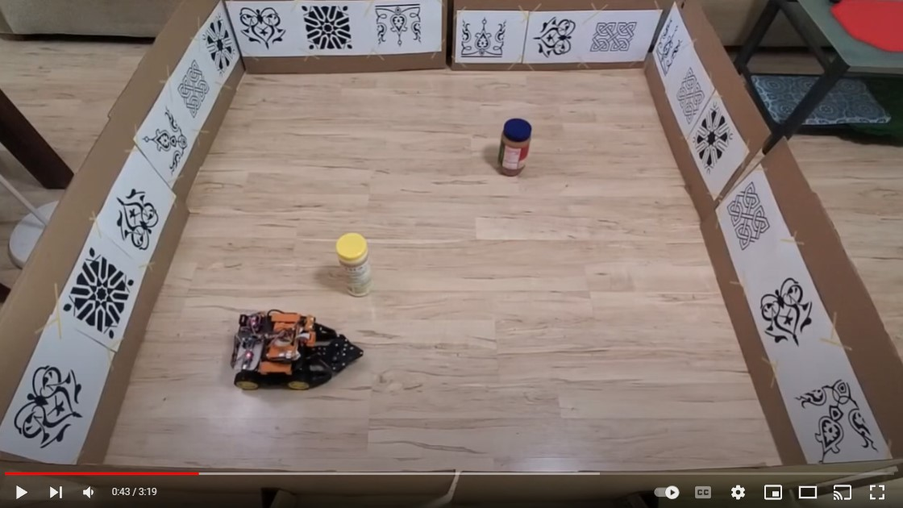

# Optical-flow Based Obstacle Avoidance
This project is based on: 
Souhila, K., & Karim, A. (2007). Optical flow based robot obstacle avoidance. International Journal of Advanced Robotic Systems, 4(1), 2.

In this project, we implemented an obstacle avoidance algorithm based on balanced optical flow and time-to-contact (TTC) calculation, using a single onboard camera. The detail of the algorithm can be found in the research paper mentioned above. 

The demo for the controller can be found below.

